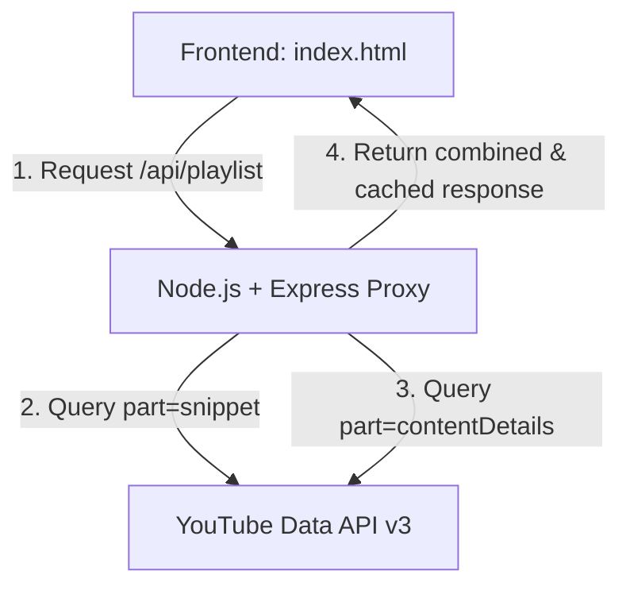

# VidSum Deployment Guide

This guide outlines how to deploy the newly converted full-stack VidSum project. Depending on your preference, you can deploy it as a unified application (monolith) or separate the frontend and backend.

---

## Architecture Overview



---

## 1. Unified Deployment (Recommended for simplicity)
In this setup, the Node.js backend serves both the API endpoints and the frontend static files (`index.html`) from the same server.

### Option A: Render
1. Create a new **Web Service** on [Render](https://render.com/).
2. Connect your GitHub repository.
3. Configure the following settings:
   - **Runtime**: `Node`
   - **Build Command**: `npm install`
   - **Start Command**: `npm start`
4. Add the following **Environment Variables** in the Render Dashboard:
   - `PORT`: `10000` (or leave blank, Render handles this)
   - `NODE_ENV`: `production`
   - `YOUTUBE_API_KEY`: `YOUR_ACTUAL_YOUTUBE_API_KEY`
   - `CORS_ORIGIN`: `*` (or your specific custom domain URL)
5. Deploy the service. Once live, Render will host both the frontend and proxy backend on the same URL!

### Option B: Railway
1. Create a new project on [Railway](https://railway.app/).
2. Select **Deploy from GitHub repo** and select your repository.
3. Railway will auto-detect Node.js and build it.
4. Go to **Variables** and add:
   - `YOUTUBE_API_KEY`: `YOUR_ACTUAL_YOUTUBE_API_KEY`
   - `NODE_ENV`: `production`
5. Railway will automatically expose a public domain. The frontend and API will run on this domain.

### Option C: VPS (Virtual Private Server - Ubuntu/Debian)
1. Install Node.js (version 18 or higher) and Git on your server:
   ```bash
   sudo apt update
   sudo apt install nodejs npm git -y
   ```
2. Clone your repository:
   ```bash
   git clone https://github.com/your-username/VidSum.git
   cd VidSum
   ```
3. Copy environment file and configure variables:
   ```bash
   cp .env.example .env
   nano .env
   ```
   *Modify `YOUTUBE_API_KEY` and set `NODE_ENV=production`.*
4. Install dependencies:
   ```bash
   npm install --production
   ```
5. Install and configure **PM2** to run the app in the background:
   ```bash
   sudo npm install -y -g pm2
   pm2 start server.js --name "vidsum"
   pm2 startup
   pm2 save
   ```
6. Set up **Nginx** as a reverse proxy forwarding traffic from port 80 to port `5000` (or your configured port).

---

## 2. Decoupled Deployment (Separate Front & Back)
This setup hosts the static HTML on Vercel (free, high performance CDN) and the Node.js backend proxy on Render or Railway.

### Step 1: Deploy Backend Proxy (Render / Railway)
Deploy the backend on Render/Railway using the steps from Section 1, but note the URL of the running server (e.g. `https://vidsum-api.onrender.com`).

### Step 2: Deploy Frontend (Vercel)
1. Go to [Vercel](https://vercel.com/) and create a new project.
2. Connect your GitHub repository.
3. Configure Vercel to build the root folder. Since it's a static `index.html` application, Vercel will deploy it instantly as a static site.
4. Set the build directory if required (default is root `./`).
5. Deploy.

### Step 3: Connect Frontend to Backend Proxy
1. Open the deployed Vercel website.
2. Click **Set API Key** / **Advanced Settings** in the header.
3. Under **Custom Backend Proxy URL**, paste your deployed Render/Railway backend URL:
   `https://vidsum-api.onrender.com`
4. Click **Save URL**.
5. All future searches will run through your private deployed backend server!

> [!IMPORTANT]
> Make sure your backend server's `.env` configuration has the Vercel frontend URL included in its `CORS_ORIGIN` environment variable (e.g., `CORS_ORIGIN=https://your-frontend.vercel.app,http://localhost:5000`) to prevent CORS blockages.
